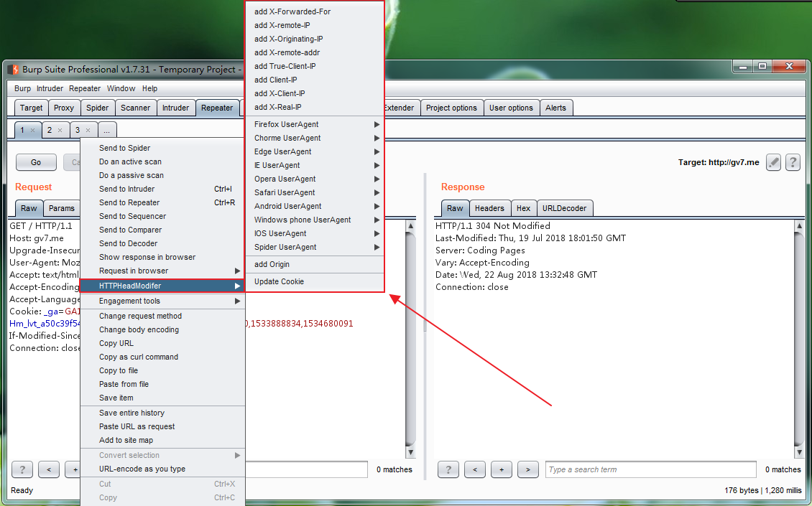

# HTTPHeadModifer
一款快速修改HTTP数据包头的Burp Suite插件

##一、插件功能
#### 1.添加IP相关的HTTP头
方便测试IP伪造，WAF绕过，HTTP盲攻击等等

#### 2.切换User-Agent
可任意切换Firefox，Chorme，Edge，IE，Opera，Safari，Android，Windows phone,IOS等浏览器和谷歌，必应，百度等各大搜索引擎爬虫的User-Agetn。

PS：数据来源于Chrome浏览器插件`User-Agent Switcher for Google Chrome`和自己补充。

#### 3.添加Origin
方便测试CROS跨域漏洞

#### 4.更新Cookie
方便更新数据包为最新可用Cookie，实现代码来自项目[knife](https://github.com/bit4woo/knife)

注意：该功能代码存在问题，正在排查。

## 二、最后的话
HTTPHeadModifer插件的目的在于 **收集渗透测试过程中涉及的HTTP头，方便我们快速添加到数据包中进行测试** 。如有一些遗漏的HTTP头，欢迎补充！